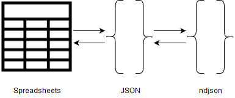

# gulp-etl-tap-spreadsheet #

This plugin converts spreadsheet files (currently tested on xlsx, xls, csv, dbf, ods, txt and html) to **gulp-etl** **Message Stream** files. This plugin is a wrapper for [xlsx](https://docs.sheetjs.com/).

This diagram shows the flow of this program. It takes a spreadsheet, converts it to a JSON, and uses that to create the message streams saved as a ndjson file, described as down below



This is a **[gulp-etl](https://gulpetl.com/)** plugin, and as such it is a [gulp](https://gulpjs.com/) plugin. **gulp-etl** plugins work with [ndjson](http://ndjson.org/) data streams/files which we call **Message Streams** and which are compliant with the [Singer specification](https://github.com/singer-io/getting-started/blob/master/docs/SPEC.md#output). In the **gulp-etl** ecosystem, **taps** tap into an outside format or system and convert their contents/output to a Message Stream, and **targets** convert/output Message Streams to an outside format or system. In this way, these modules can be stacked to convert from one format or system to another, either directly or with tranformations or other parsing in between. Message Streams look like this:

```
{"type": "SCHEMA", "stream": "users", "key_properties": ["id"], "schema": {"required": ["id"], "type": "object", "properties": {"id": {"type": "integer"}}}}
{"type": "RECORD", "stream": "users", "record": {"id": 1, "name": "Chris"}}
{"type": "RECORD", "stream": "users", "record": {"id": 2, "name": "Mike"}}
{"type": "SCHEMA", "stream": "locations", "key_properties": ["id"], "schema": {"required": ["id"], "type": "object", "properties": {"id": {"type": "integer"}}}}
{"type": "RECORD", "stream": "locations", "record": {"id": 1, "name": "Philadelphia"}}
{"type": "STATE", "value": {"users": 2, "locations": 1}}
```

### Usage
**gulp-etl** plugins accept a configObj as the first parameter, and sheetOpts is an optional second parameter.
The configObj is the "Parsing Options" object for [xlsx](https://docs.sheetjs.com/) described [here](https://docs.sheetjs.com/#parsing-options). The sheetOpts are the options for generating a JSON object with [xlsx](https://docs.sheetjs.com/) described [here](https://docs.sheetjs.com/#json). If a file has multiple sheets, they will be exported to a single file with the stream name indicating the sheet name. The exported file will be a ndjson file.

If HTML and TXT files are exported from excel they will import properly. Otherwise, HTML tables must be a simple format of having a header for every column, containing the columns name.

##### Sample gulpfile.js

<!-- embedme gulpfile.js -->

```js
var gulp = require("gulp");
var tapSpreadSheet = require("./src/plugin").tapSpreadSheet;

function runTapSpreadSheet(callback) {
    return gulp
        .src(["./testdata/*", "!./testdata/ignore", "!./testdata/processed"])
        .pipe(tapSpreadSheet({ type: "buffer" }, { raw: false }))
        .pipe(gulp.dest("./testdata/processed"));
}

exports["default"] = gulp.series(runTapSpreadSheet);

```

### Quick Start for Coding on This Plugin
* Dependencies:
    * [git](https://git-scm.com/downloads)
    * [nodejs](https://nodejs.org/en/download/releases/) - At least v6.3 (6.9 for Windows) required for TypeScript debugging
    * npm (installs with Node)
    * typescript - installed as a development dependency
* Clone this repo and run `npm install` to install npm packages
* Debug: with [VScode](https://code.visualstudio.com/download) use `Open Folder` to open the project folder, then hit F5 to debug. This runs without compiling to javascript using [ts-node](https://www.npmjs.com/package/ts-node)
* Test: `npm test` or `npm t`
* Compile to javascript: `npm run build`
* Run default task : `npm run defaultTask`

### Testing

We are using [Jest](https://facebook.github.io/jest/docs/en/getting-started.html) for our testing. Each of our tests are in the `test` folder.

- Run `npm test` to run the test suites


Note: This document is written in [Markdown](https://daringfireball.net/projects/markdown/). We like to use [Typora](https://typora.io/) and [Markdown Preview Plus](https://chrome.google.com/webstore/detail/markdown-preview-plus/febilkbfcbhebfnokafefeacimjdckgl?hl=en-US) for our Markdown work..
This document utilalized [embedme](https://www.npmjs.com/package/embedme) in order to embed code into readme
